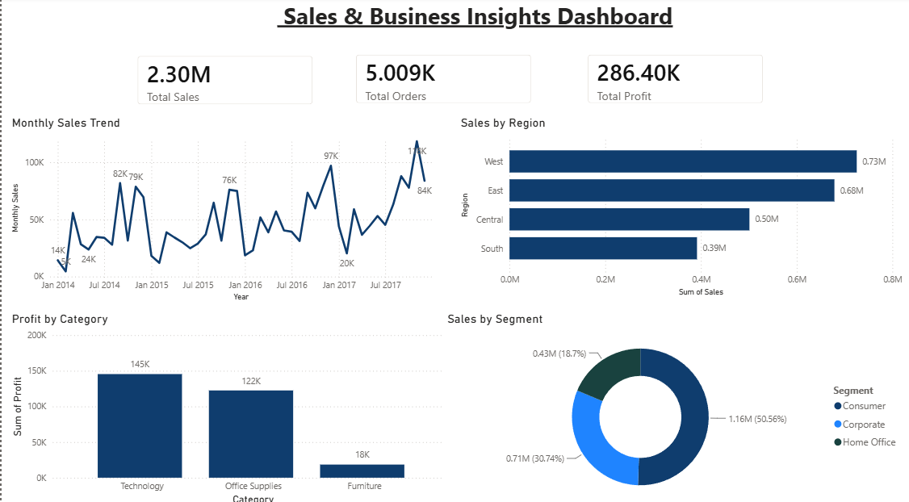
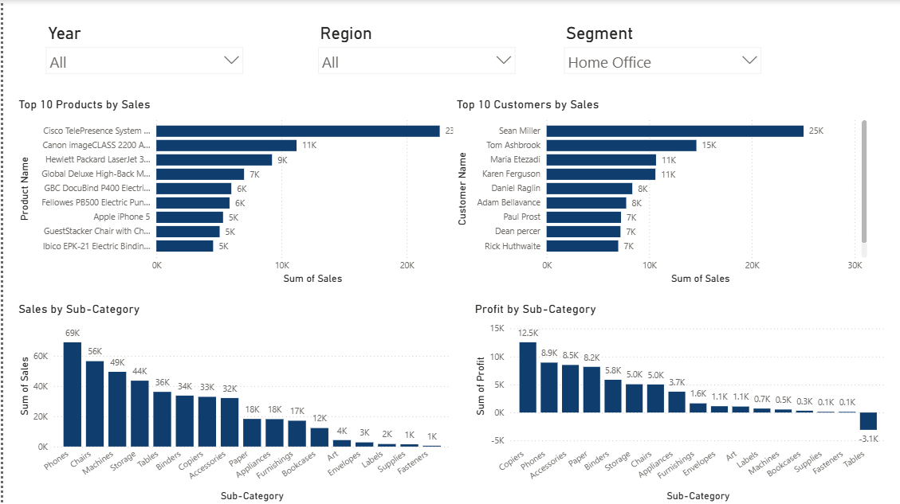
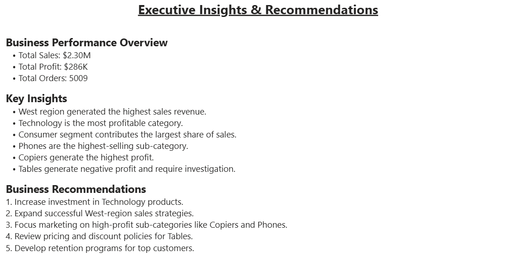

# 📊 Sales & Business Insights Dashboard

## Project Overview

This project analyzes sales performance, customer behavior, product profitability, and regional business performance using Python (Pandas) and Power BI.

The goal is to transform raw sales data into meaningful business insights that support data-driven decision-making.

---

## Tools & Technologies

- Python
- Pandas
- Power BI
- CSV Dataset
- GitHub

---

## Project Workflow

### 1. Data Cleaning (Python)

Performed data cleaning and transformation using Pandas:

- Checked data types
- Checked missing values
- Checked duplicate records
- Converted date columns
- Created Year, Month, and Month Number columns

### 2. Business Analysis

Calculated key business metrics:

- Total Sales
- Total Profit
- Total Orders
- Top Products
- Top Customers
- Sales by Region
- Profit by Category
- Monthly Sales Trend

### 3. Dashboard Development (Power BI)

Created an interactive Power BI dashboard consisting of:

#### Executive Sales Dashboard
- Total Sales KPI
- Total Profit KPI
- Total Orders KPI
- Monthly Sales Trend
- Sales by Region
- Profit by Category
- Sales by Segment

#### Product & Customer Analysis
- Top 10 Products by Sales
- Top 10 Customers by Sales
- Sales by Sub-Category
- Profit by Sub-Category
- Interactive Filters

#### Executive Insights & Recommendations
- Key Findings
- Business Recommendations
- Performance Summary

---

# Key Insights

### Regional Performance
- West region generated the highest sales revenue.
- South region generated the lowest sales revenue.

### Product Performance
- Phones were the highest-selling sub-category.
- Copiers generated the highest profit.

### Customer Analysis
- Consumer segment contributed the largest share of sales.

### Profitability Analysis
- Technology was the most profitable category.
- Tables generated negative profit and require further investigation.

---

# Business Recommendations

1. Increase investment in Technology products.
2. Expand successful sales strategies used in the West region.
3. Focus marketing on high-profit products such as Copiers and Phones.
4. Review pricing and discount policies for Tables.
5. Develop retention strategies for high-value customers.

---

# Dashboard Screenshots

## Executive Sales Dashboard

## Product & Customer Analysis

## Executive Insights & Recommendations

---

# Skills Demonstrated

- Data Cleaning
- Data Transformation
- Exploratory Data Analysis (EDA)
- Business Intelligence
- Data Visualization
- Dashboard Development
- KPI Analysis
- Business Reporting

---

# Author

Muhammed Afsal

Aspiring Data Analyst | Python | Power BI | Data Analytics
